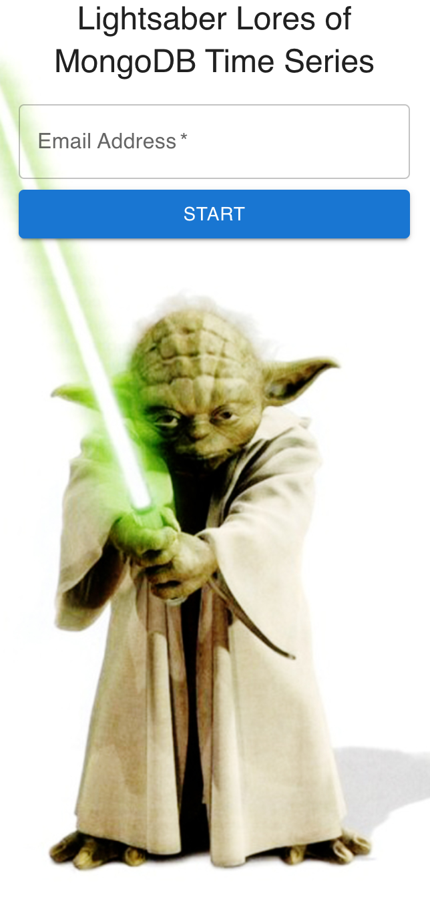
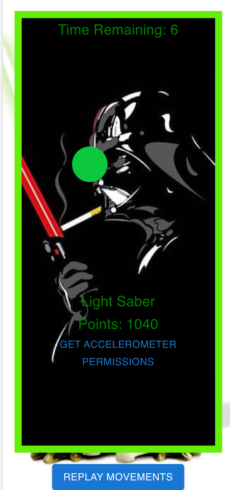

# Lightsaber Lores of MongoDB Time Series

Lightsaber Lores of MongoDB Time Series is a web application designed to showcase the timeseries collection capabilities of MongoDB by storing precise device motion data. The frontend is built with React, and the backend is implemented using MongoDB Atlas App Services. 



## Prerequistes

1. Created a new MongoDB Atlas project for your Lightsaber app
2. Created a new cluster inside that project for Lightsaber data that is running
3. Created an API Key inside that project, and recorded the public and private api keys,for more information see https://www.mongodb.com/docs/atlas/configure-api-access/#create-an-api-key-for-a-project
4. Installed dependencies for this script: node, mongodb-realm-cli"

## Install Realm CLI
```
npm install -g mongodb-realm-cli
```

## Update env.var

Update the env.var to reflect your settings, you will need to update.
The REALM_CLIENT_APP_ID you will need to update after that you have run the realm cli create command in the next step.

Example:
```
ATLAS_CLUSTER_NAME=demo-cluster
ATLAS_PUBLIC_API_KEY=wancyeds
ATLAS_PRIVATE_API_KEY=db235axa-xdyd-3543-b534-19fe60e755ef
ATLAS_PROJECT_ID=5f49dca27a4f7e35487f7e0c
APPLICATION_NAME=starwars-lightsaber-timeseries
REALM_CLIENT_APP_ID=
```

## Create an New App in Atlas App Services
You will need to create an App in Atlas services, here is how you do it using the Realm CLI. You can also do it using the UI.

```
source env.var
realm-cli apps create -y -n "$APPLICATION_NAME" --project="$ATLAS_PROJECT_ID" --cluster="$ATLAS_CLUSTER_NAME"
```

Once you have created the app you will need to get the client_app_id from the console output from the above command and update REALM_CLIENT_APP_ID in the env.var file.

Example:
```
ATLAS_CLUSTER_NAME=demo-cluster
ATLAS_PUBLIC_API_KEY=wancyeds
ATLAS_PRIVATE_API_KEY=db235axa-xdyd-3543-b534-19fe60e755ef
ATLAS_PROJECT_ID=5f49dca27a4f7e35487f7e0c
APPLICATION_NAME=starwars-lightsaber-timeseries
REALM_CLIENT_APP_ID=starwars-lightsaber-timeseries-onvhi
```

#### Update App.js
Update in App.js file and the below field with your REALM_CLIENT_APP_ID that you have in the env.var file. 

```
const REALM_APP_ID='starwars-lightsaber-timeseries-onvhi';
```

## Create database and load with with data
Connect to you MongoDB Cluster, using the MongoShell, you can access mongoshell from the MongoDB Compass. And then run these commands
```
// Create Timeseries collection to be used to store device sensor data.
use starwars
// Create a MongoDB TimeSeries collection, that will store all the hints.
db.createCollection(
    "timeseries",
    {
       timeseries: {
          timeField: "timestamp",
          metaField: "email",
          granularity: "seconds"
       }
    }
)
```
### Deploy application to App Services

Run below command in root of repo, it will build the application and deploy it to App Services
```
source env.var
./deploy.sh
```

### Enable Hosting on App Services

You need to manually enable hosting:
https://www.mongodb.com/docs/atlas/app-services/hosting/enable-hosting/

### Access the application 
You can now access the application from the endpoint described, in app/hosting/config.json   

Example below:
```
"app_default_domain": "starwars-lightsaber-timeseries-onvhi.mongodbstitch.com"

```

Navigate to https://starwars-lightsaber-timeseries-onvhi.mongodbstitch.com

### Run Application with Local Frontend and Atlas Appservices as Backend

Run below command in root of repo, it will build the application and deploy it to App Services
```
npm run start:https
```
## Game Play

1. User provides email adress


2. Balancing a ball, to get higher level on lightsaber, user will collect points if within gamefield boundaries, If not will loose points. All this data is stored in a time series collection. To run on `APPLE` devices the user will neeed to request access to sensors by clicking on `GET ACCELERATOR PERMISSIONS`. 



3. Lightsaber is shown, your device will pulsate different colors, and make lightsaber sounds, based on accelertion and orientation of your device. All this data is stored in a time series collection.


## What the Application Does

1. **User Interface**: The frontend presents an engaging user interface featuring a virtual lightsaber.

2. **Device Orientation**: It utilizes the `window.addEventListener('deviceorientation', handleOrientation)` to capture precise data from the device's gyroscope and accelerometer. This data includes information about the device's orientation in three dimensions: alpha (rotation around the z-axis), beta (rotation around the x-axis), and gamma (rotation around the y-axis). To run on `APPLE` devices the user will neeed to request access to sensors by clicking on `GET ACCELERATOR PERMISSIONS`. 

3. **Color Control**: The alpha value from the device orientation data is meticulously mapped to control the hue of the lightsaber's color. As the user moves their device, the lightsaber's color dynamically changes to reflect the device's orientation.

4. **Audio Feedback**: To enhance the user experience, audio feedback is provided when the lightsaber's color changes. An audio file (`lightsaber.mp3`) is played using the Howler library.

5. **Pulsating Animation**: To make the lightsaber's color change more visually captivating, a pulsating animation is applied whenever the color changes.

6. **Data Transmission**: Device orientation data is continuously sent to the backend server via a Atlas Appservices endpoint (`/data`) in the form of a JSON object and stored in an Timeseries collection, `starwars.timeseries`

7. **Replay**: User can replay session by pressing replay button. All records for the specific email will be requested using the Atlas App Services endpoint (`/session`) and will be replayed for user.